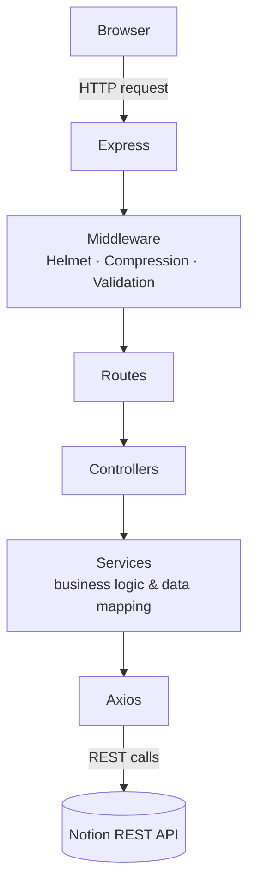

<div align="center">

# 📥 Inboxios

**Never lose an idea. Capture instantly, sync seamlessly with Notion.**

<p>
  
  
  
  
  
  
  
</p>

<sub>Built with Express, EJS, Axios, and the Notion REST API — no SDK, just HTTP.</sub>

</div>

---

## Overview

Every good idea has a shelf life measured in seconds. By the time Notion has loaded, half of them are gone.

**Inboxios** is a lightweight, offline-first task capture app that sits between "I just thought of something" and "it's safely in my Notion database." Open it, type, done — the sync happens in the background.

It was also built as a deliberate learning exercise: to understand **REST API architecture**, **clean layered backend design**, and **CRUD operations** by talking to the Notion API directly over HTTP with Axios, rather than hiding that complexity behind the official SDK.

> **Why the name?** Inbox + Axios = **Inboxios** — a capture inbox, powered by Axios.

---

## Table of Contents

- [Features](#features)
- [Tech Stack](#tech-stack)
- [Architecture](#architecture)
- [Project Structure](#project-structure)
- [Getting Started](#getting-started)
- [Environment Variables](#environment-variables)
- [Setting Up Notion](#setting-up-notion)
- [API Reference](#api-reference)
- [Design Decisions](#design-decisions)
- [Performance](#performance)
- [Security](#security)
- [Testing](#testing)
- [Roadmap](#roadmap)
- [Known Limitations](#known-limitations)
- [Contributing](#contributing)
- [License](#license)
- [Acknowledgements](#acknowledgements)
- [Author](#author)

---

## Features

### 📝 Task Management

- Create, edit, and delete tasks
- Due dates and status management
- Status filtering with persistent state via Local Storage

### ⚡ Productivity

- Server-side rendering for instant first paint
- Responsive interface across devices
- Minimal, distraction-free capture flow

### 🎨 Interface

- Custom **Catppuccin Mocha** theme
- Glassmorphism panels and gradient cards
- Gradient text and subtle CSS animations
- Native HTML `<dialog>` elements
- Accessible keyboard focus states
- Custom scrollbar styling

### 🧪 Modern CSS

- `@starting-style`
- `@container` queries
- `color-mix()`
- `if() / else()`
- View Transitions API

### 🏗️ Backend

- Layered architecture (routes → controllers → services)
- Axios-based API layer with clean data mapping
- Express middleware pipeline
- Response compression
- Helmet security headers
- Static asset caching

### ✅ Testing

- Vitest test suite
- Task mapper tests
- Database schema validation tests

---

## Tech Stack

| Layer             | Technology         |
| ----------------- | ------------------ |
| Runtime           | Node.js 22+        |
| Backend Framework | Express 5          |
| API Client        | Axios              |
| Database          | Notion             |
| Template Engine   | EJS                |
| Frontend          | Vanilla JavaScript |
| Styling           | Vanilla CSS        |
| Testing           | Vitest             |
| Package Manager   | npm                |

---

## Architecture

Inboxios follows a strict layered architecture so that HTTP concerns, business logic, and data access never bleed into one another.



**Request lifecycle:**

1. The browser sends a request to Express.
2. Middleware handles security headers, compression, and input validation.
3. Routes dispatch to the appropriate controller.
4. Controllers coordinate the request/response and delegate logic to services.
5. Services map data and call the Notion REST API through the Axios layer.

---

## Project Structure

```text
assets/              Screenshots and README assets
scratch/              Experimental scripts
src/
 ├── config/           App and environment configuration
 ├── controllers/       Request/response orchestration
 ├── middlewares/         File caching
 ├── public/                Static assets (CSS, client JS, icons)
 ├── routes/                 Route definitions
 ├── services/                Notion API calls & data mapping
 ├── utils/                     Shared helpers
 └── views/                      EJS templates
tests/                Vitest test suite
```

---

## Getting Started

### Prerequisites

- Node.js 22 or later
- A Notion account with an integration set up ([see below](#setting-up-notion))

### Installation

```bash
git clone https://github.com/OzenFern/Inboxios.git
cd Inboxios

npm install
cp .env.example .env

npm run dev
```

The app will start locally — check your terminal output for the port and URL.

---

## Environment Variables

Create a `.env` file (or copy `.env.example`) and set the following:

| Variable              | Description                        |
| --------------------- | ---------------------------------- |
| `PORT`                | Port the Express server listens on |
| `NOTION_ACCESS_TOKEN` | Your Notion Integration Token      |
| `NOTION_DS_ID`        | Your Notion Data Source ID         |

---

## Setting Up Notion

1. [Create a Notion Integration](https://www.notion.so/my-integrations) and copy its access token.
2. Duplicate or create your task database in Notion.
3. Share that database with your integration.
4. Copy the database's **Data Source ID**.
5. Populate `.env` with your token and Data Source ID.
6. Run `npm run dev`.

Inboxios validates your database schema on startup and will tell you immediately if something's misconfigured.

> [!TIP]
> Don't want to build the database schema by hand? Duplicate the official **Inboxios Notion Template** — everything is pre-configured and ready to connect.
>
> [🔗*Template Link*](https://ozenf.notion.site/cd94f0d949c1834aab81810764b9cd3c?v=0154f0d949c18313b1be08e4a4d3c1c7&source=copy_link)

---

## API Reference

| Method   | Endpoint     | Description             |
| -------- | ------------ | ----------------------- |
| `GET`    | `/tasks`     | Fetch all tasks         |
| `POST`   | `/tasks`     | Create a new task       |
| `PATCH`  | `/tasks/:id` | Update an existing task |
| `DELETE` | `/tasks/:id` | Delete a task           |

---

## Design Decisions

**Why Axios instead of the official SDK?**
To learn HTTP requests, REST semantics, and data mapping without abstraction hiding the mechanics — every request and response is explicit.

**Why server-side rendering?**
Faster first render, minimal client-side JavaScript, simpler deployment, and a cleaner overall architecture.

**Why vanilla CSS, no framework?**
Modern CSS is powerful enough on its own. Inboxios is a showcase for native platform features like `@container`, `color-mix()`, and View Transitions — not a framework wrapper.

**Why native `<dialog>` elements?**
Built-in accessibility, focus trapping, and simpler markup with far less JavaScript than a custom modal implementation.

---

## Performance

- Express response compression
- Static asset caching
- Local Storage filter persistence (no re-fetch on reload)
- Server-side rendering for fast first paint
- Minimal dependency footprint

---

## Security

- Helmet security headers
- Server-side input validation
- Database schema validation on startup
- Strict layered architecture to isolate concerns

---

## Testing

Run the test suite with:

```bash
npm run test
```

Current coverage includes:

- Task mapper logic
- Database schema validation

Built with **Vitest**.

---

## Roadmap

- [x] CRUD operations
- [x] Responsive UI
- [x] Dark theme (Catppuccin Mocha)
- [x] Server-side rendering
- [x] Notion REST API integration
- [ ] Search
- [ ] Offline task cache
- [ ] Authentication
- [ ] Multi-user support
- [ ] Settings page
- [ ] Light theme

---

## Known Limitations

- Time fields are not fully implemented yet.
- No authentication layer — intended for self-hosted, single-user use.
- Offline caching is still in development.
- Requires self-hosting; no hosted version is currently offered.

---

## Contributing

Contributions are welcome and appreciated.

1. Fork the repository.
2. Create a feature branch (`git checkout -b feature/my-feature`).
3. Commit your changes with clear messages.
4. Open a Pull Request against the `dev` branch.

Active development happens on `dev`; stable releases are merged into `main`.

---

## License

Licensed under the [MIT License](LICENSE).

---

## Acknowledgements

- [Notion](https://www.notion.so)
- [Axios](https://axios-http.com)
- [Express](https://expressjs.com)
- [Bootstrap Icons](https://icons.getbootstrap.com)
- [Heroicons](https://heroicons.com)
- [Google Fonts](https://fonts.google.com)
- [Unsplash](https://unsplash.com)
- [Catppuccin](https://catppuccin.com)

---

## Author

**Ozen Fernandes**

Computer Science & Engineering student passionate about backend development, REST APIs, clean architecture, modern CSS, and developer tooling.

<div align="center">

If you found this project interesting, consider giving it a ⭐ on GitHub.

</div>
